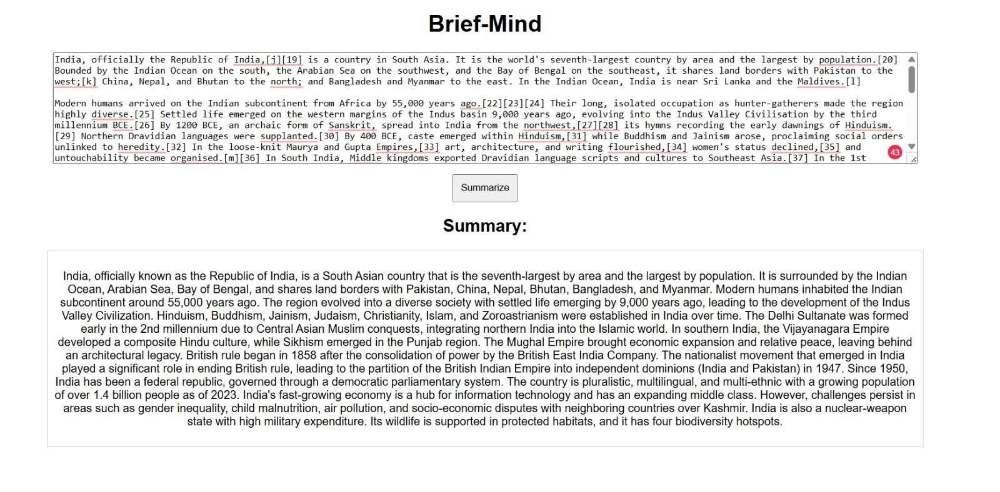
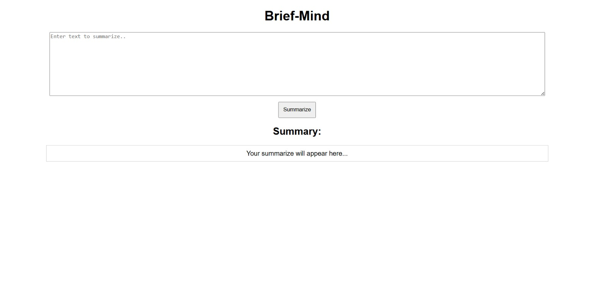

# Brief-Mind

An AI-powered text summarization web application built using FastAPI,
HTML/CSS/JavaScript, and Mistral running locally through Ollama.

## Tech Stack

- Python
- FastAPI
- Ollama
- Mistral
- HTML
- CSS
- JavaScript

## Architecture

Browser → FastAPI → Ollama → Mistral → FastAPI → Browser

## How to Run

1. Install Ollama
2. Pull Mistral:

   ollama pull mistral

3. Install Python dependencies:

   pip install -r requirements.txt

4. Start the FastAPI application:

   python app.py

5. Open:

   http://localhost:8000

## Features

- Local LLM inference
- Text summarization
- FastAPI backend
- Simple web interface
- No external LLM API required

## Demo

### Homepage

